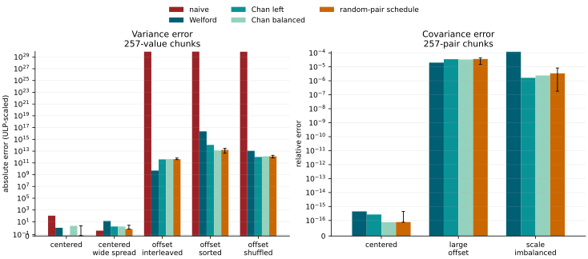
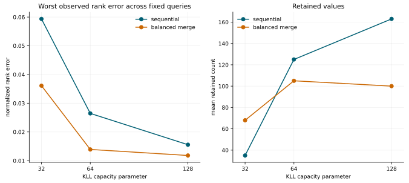

# streaming-statistics

An OCaml library for statistics that update one observation at a time. Its API
keeps three distinctions visible: exact versus approximate results,
bounded versus growing storage, and summaries that can or cannot be merged.

`Summary` maintains extrema, a compensated sum, Welford's mean, and population
or sample variance. `Bivariate` maintains covariance, Pearson correlation, and
simple linear regression. Both use constant-size state and merge independent
partitions with centred-moment formulas.

`Exact_median` retains finite observations in a max-heap and a min-heap. An
insertion costs `O(log n)`, reading the median costs `O(1)`, and storage is
`O(n)`. It deliberately exposes no merge operation.

`Reservoir` implements Algorithm R for polymorphic streams. Its capacity and
seed are explicit, it retains at most `k` observations, and `sample` returns a
copy of its slots. It deliberately exposes no merge operation.

`Kll` provides seeded approximate quantiles for finite floating-point streams.
It keeps weighted levels under a concrete decreasing-capacity schedule, uses
the lower empirical quantile convention, and merges sketches with equal
configured capacities using an explicit result seed. Exact stream extrema are
preserved for the endpoint queries. No epsilon guarantee is inferred from the
capacity parameter. The implementation applies the compactor principle from the
[KLL paper](https://arxiv.org/abs/1603.05346) but is not a byte-compatible port
of Apache DataSketches.

`Bundle` feeds a `Summary` and configured exact median, reservoir, and KLL
components in one pass. It keeps their distinct query, storage, and merge
contracts instead of imposing a universal accumulator interface.

## Build and install

OCaml 5.1 or later and Dune 3.12 or later are required.

```sh
dune build @all
dune runtest
dune exec examples/basic.exe
dune exec examples/quantiles.exe
opam install .
```

```ocaml
open Streaming_statistics

let stats = Summary.create ()

let () =
  List.iter
    (fun x ->
      match Summary.add stats x with
      | Ok () -> ()
      | Error `Non_finite -> invalid_arg "finite observations only"
      | Error `Count_overflow -> failwith "observation count overflow")
    [ 1.; 2.; 3.; 4. ];
  Option.iter (Printf.printf "mean = %.2f\n") (Summary.mean stats)
```

## v0.1 capabilities

| Component | Result | Update | Storage | Merge |
| --- | --- | --- | --- | --- |
| `Summary` | moments, extrema, compensated sum | `O(1)` | `O(1)` | yes |
| `Bivariate` | covariance, correlation, simple OLS | `O(1)` | `O(1)` | yes |
| `Exact_median` | exact median | `O(log n)` | `O(n)` | no |
| `Reservoir` | uniform sample | expected `O(1)` | `O(k)` | no |
| `Kll` | approximate empirical quantiles | amortized compaction | capacity-controlled | compatible sketches |
| `Bundle` | configured univariate components in one pass | follows components | follows components | no |

The conventions for empty streams, estimators, non-finite values, quantiles,
seeds, and merges are fixed in [docs/CONTRACTS.md](docs/CONTRACTS.md).

## Numerical checks

`dune runtest` also compares sequential Welford updates and a partitioned Chan
merge with a high-precision oracle on a small cancellation-prone corpus. The
private naive baseline and tolerances are documented in
[experiments/README.md](experiments/README.md).

The numerical experiment suite varies offset, dispersion, stream order,
partition size, and reduction shape for univariate and paired moments, then
compares exact and approximate quantiles. Reproduce both CSV files, both SVG
figures, and their manifest with one command:

```sh
python3 -m pip install -r requirements-experiments.txt
python3 experiments/run_experiments.py
```

On the sorted `1e12`-offset stream, the population-variance oracle is
`0.0008499154`. Sequential Welford returns `0.003354809`, a balanced Chan
reduction over 257-value chunks returns `0.0008513299`, and the naive identity
returns about `8.75e10`. This case does not establish a universally preferable
tree; it shows why the reduction shape is recorded.

For the same partition size, the 32 fixed random-pair schedules produce 32
distinct variance estimates on that stream. Their absolute errors range from
`4.80e-7` to `3.16e-6`, with median `1.75e-6`. The paired large-offset stream
also produces 32 distinct covariance estimates, with observed relative error
from `1.49e-5` to `4.49e-5` and median `3.64e-5`. These fixed-schedule ranges are
not confidence intervals, worst cases, or error bounds.

With 1,024-pair chunks, 34 Chan correlation rows on the large-offset case are
undefined because their raw ratios fall materially outside `[-1, 1]`; the CSV
keeps them as `nan` instead of clamping them to a plausible endpoint. See the
[protocol](docs/EXPERIMENTS.md), [raw table](results/moment_stability.csv), and
[manifest](results/manifest.json) before interpreting the figure.



The quantile experiment compares `Exact_median` and KLL with a full sort on
normal, signed heavy-tailed, regime-change, and duplicate-heavy streams. KLL is
run at capacities 32, 64, and 128 with five fixed seeds, both sequentially and
through one pre-specified balanced merge of 257-value partitions. Its 844-row
table and figure are included in the reproduction command above.

All four exact medians match the sort oracle. In the fixed signed-Pareto trials,
the largest endpoint relative-value error occurs at `q = 0.99`, capacity 32,
seed 83: a `0.895%` normalized rank error accompanies a `397.3%` relative-value
error. This retained observation illustrates that small observed rank error
does not imply small error in the units of a sparse tail; it is not a
worst-case bound or a risk model. The
[raw table](results/quantile_accuracy.csv),
[protocol](docs/EXPERIMENTS.md), and [manifest](results/manifest.json) retain
the full grid and its limitations.



## Scope

Version 0.1 is append-only. Sliding windows, retractions, serialization,
weighted observations, concurrency, servers, and market-data infrastructure are
outside its scope. No performance or error bound is claimed before a
reproducible experiment measures it.

## License

MIT
